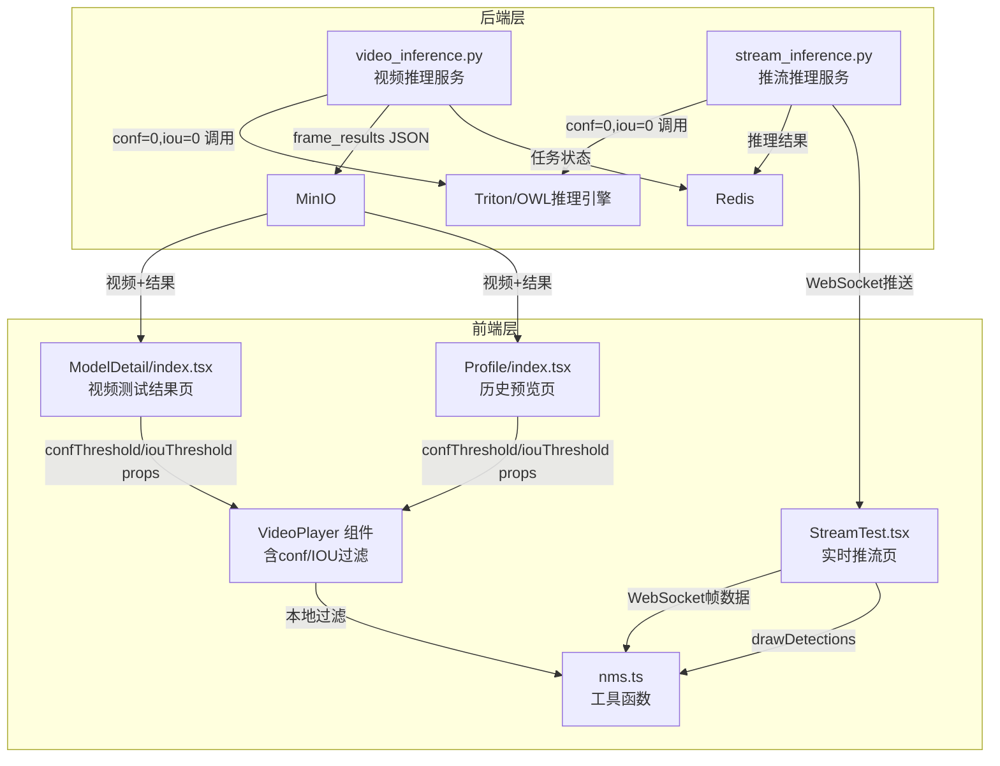
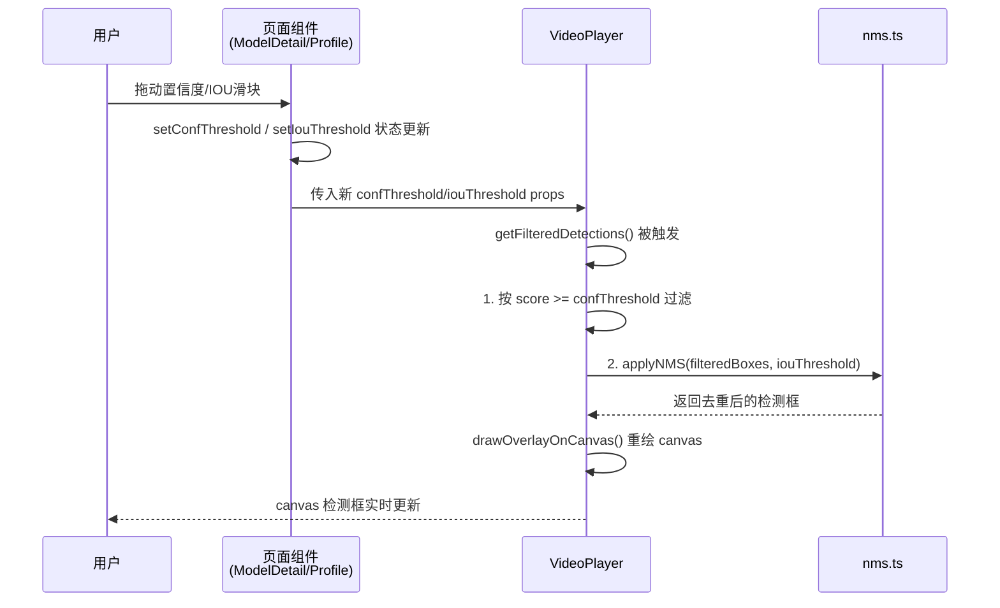
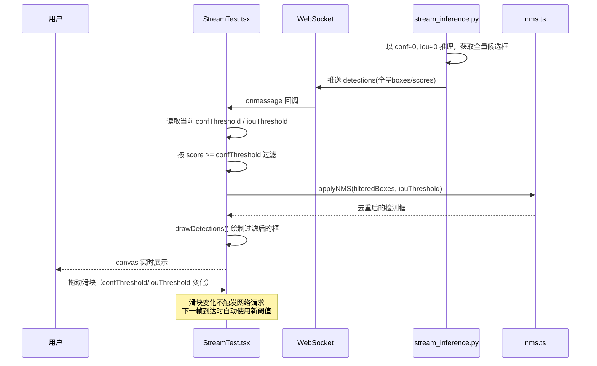
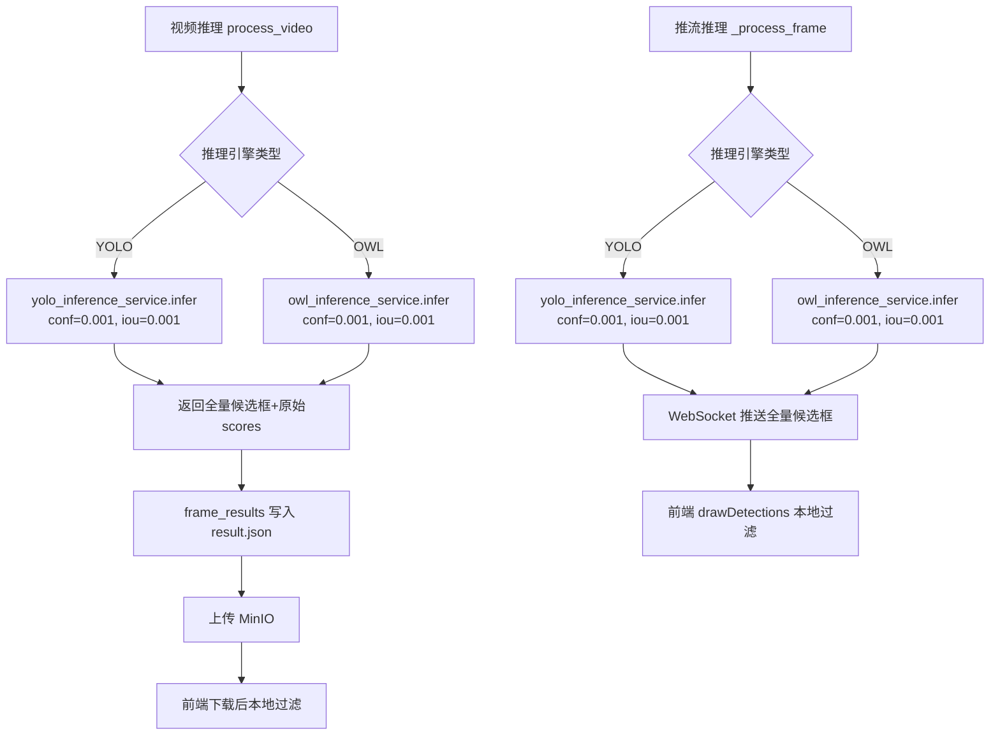
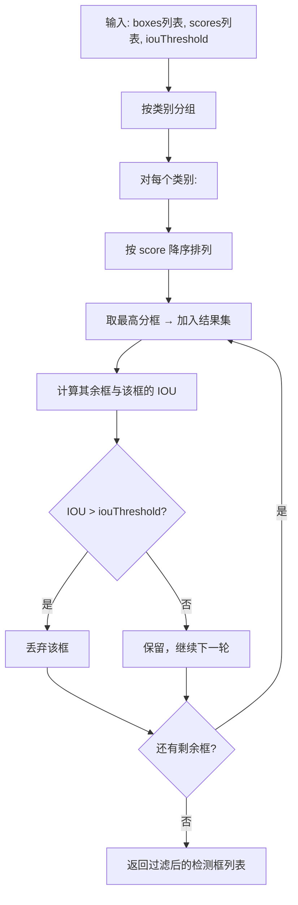

# 技术架构设计文档 - 置信度与 IOU 实时调整功能

**版本**: v1.0  
**日期**: 2025-07-11  
**对应需求**: requirements.md v1.3

---

## 1. 架构概述

### 1.1 核心架构思路

本功能采用**后端零过滤 + 前端动态过滤**的架构模式：

- **后端**：推理时以极低阈值（conf≈0、iou≈0）输出所有候选框及原始分数，不在服务端做阈值过滤
- **前端**：在本地维护 `confThreshold` / `iouThreshold` 状态，对后端返回的原始检测框实时执行置信度过滤 + NMS 过滤，无需回调后端

此方案的核心优势：参数调整纯在前端完成，响应无网络延迟，实时流畅。

### 1.2 架构原则

- **单一职责**：NMS 工具函数独立在 `utils/` 中，VideoPlayer 和 StreamTest 均复用
- **最小改动**：后端数据结构不变，仅修改推理阈值参数；前端通过新增 props 而非重构组件方式扩展
- **向后兼容**：`VideoPlayer` 新增 props 均有默认值，不影响现有调用方

---

## 2. 系统架构

### 2.1 整体架构图



### 2.2 架构分层

#### 2.2.1 前端层

- **页面组件**（`ModelDetail/index.tsx`、`StreamTest.tsx`、`Profile/index.tsx`）：管理 `confThreshold` / `iouThreshold` 状态，提供滑块控件
- **VideoPlayer 组件**（`components/VideoPlayer/index.tsx`）：接收阈值 props，在 `getFilteredDetections` 中执行本地过滤与 NMS
- **工具函数**（`utils/nms.ts`）：提供通用 NMS 算法，被 VideoPlayer 和 StreamTest 复用

#### 2.2.2 后端层

- **视频推理**（`video_inference.py`）：将 `infer_frame` 调用的 `conf_threshold` 和 `iou_threshold` 改为固定极低值（如 0.001）
- **推流推理**（`stream_inference.py`）：将 `_process_frame` 中推理引擎调用的阈值参数改为固定极低值，`StreamSession.conf_threshold/iou_threshold` 字段保留但不再传给引擎

---

## 3. 模块设计

### 3.1 模块职责划分

| 模块 | 文件路径 | 变更类型 | 职责说明 |
|------|---------|---------|---------|
| NMS工具函数 | `frontend/src/utils/nms.ts` | **新建** | 提供 `applyNMS(boxes, scores, iouThreshold)` 函数，被前端多处复用 |
| VideoPlayer | `frontend/src/components/VideoPlayer/index.tsx` | **扩展** | 新增 `confThreshold`、`iouThreshold` props；在 `getFilteredDetections` 中追加 conf 过滤 + NMS 过滤 |
| StreamTest | `frontend/src/pages/ModelDetail/StreamTest.tsx` | **修改** | 解除推流激活时滑块禁用；`drawDetections` 调用前先执行本地过滤 |
| ModelDetail | `frontend/src/pages/ModelDetail/index.tsx` | **修改** | 将 `confThreshold`/`iouThreshold` 作为 props 传给 VideoPlayer（视频结果区） |
| Profile | `frontend/src/pages/Profile/index.tsx` | **修改** | 预览弹窗中增加 conf/IOU 滑块状态，传给 VideoPlayer |
| video_inference | `backend/app/core/video_inference.py` | **修改** | `process_video` 调用 `infer_frame` 时固定使用极低阈值 |
| stream_inference | `backend/app/core/stream_inference.py` | **修改** | `_process_frame` 调用推理引擎时固定使用极低阈值 |

### 3.2 前端组件交互



### 3.3 推流过滤流程



### 3.4 后端推理阈值变更流程



---

## 4. 关键算法设计

### 4.1 前端 NMS 算法

NMS（Non-Maximum Suppression）用于去除同类别中与高分框高度重叠的低分框，算法流程如下：



**IOU 计算**：`IOU = 交集面积 / 并集面积`，两框坐标格式均为 `[x1, y1, x2, y2]`

**工具函数接口设计**：

`nms.ts` 导出 `applyNMS` 函数，接受检测框列表（每项含 `box`、`score`、`className` 字段）和 `iouThreshold` 参数，返回经 NMS 过滤后的检测框列表。

### 4.2 VideoPlayer 过滤逻辑扩展

现有 `getFilteredDetections` 仅做类别过滤，改造后的过滤流程：

1. **类别过滤**：`className ∈ selectedClasses`（已有逻辑）
2. **置信度过滤**：`score >= confThreshold`（新增）
3. **NMS 过滤**：对通过前两步的框调用 `applyNMS(iouThreshold)`（新增）

### 4.3 参数默认值

| 模型类型 | confThreshold 默认值 | iouThreshold 默认值 |
|---------|---------------------|---------------------|
| 普通 YOLO 模型 | 0.25 | 0.45 |
| OWL 模型 | 0.10 | 0.30 |
| 参数范围 | [0, 1]，步长 0.05 | [0, 1]，步长 0.05 |

---

## 5. 组件接口设计

### 5.1 VideoPlayer 新增 Props

| Prop 名称 | 类型 | 默认值 | 说明 |
|----------|------|--------|------|
| `confThreshold` | `number` | `0.25` | 置信度阈值，score < confThreshold 的框被过滤 |
| `iouThreshold` | `number` | `0.45` | IOU 阈值，与高分框 IOU 超过此值的框被 NMS 去除 |

**触发重绘时机**：现有 `useEffect([currentTime, selectedClasses, drawOverlay])` 需追加 `confThreshold`、`iouThreshold` 依赖，确保滑块变化时 canvas 立即重绘。

### 5.2 各页面滑块控件位置

| 页面 | 滑块位置 | 状态管理 |
|------|---------|---------|
| `ModelDetail/index.tsx`（视频结果） | `VideoPlayer` 上方，视频任务完成后显示 | 页面级 state（`confThreshold`/`iouThreshold`） |
| `StreamTest.tsx`（推流页） | 已有滑块区域，移除 `disabled={streamSession?.status === 'active'}` | 已有 state（`confThreshold`/`iouThreshold`） |
| `Profile/index.tsx`（历史预览弹窗） | 弹窗内 `VideoPlayer` 上方新增滑块区域 | 新增弹窗级 state |

---

## 6. 数据流设计

### 6.1 视频推理数据流（改造前后对比）

| 阶段 | 改造前 | 改造后 |
|------|--------|--------|
| 后端推理 | conf=用户传入值，iou=用户传入值，服务端过滤后存储 | conf=0.001，iou=0.001，全量候选框存储至 result.json |
| result.json 数据量 | 仅包含通过阈值的框 | 包含所有候选框（数据量增大） |
| 前端接收 | 直接渲染（无过滤） | 本地过滤（conf + NMS） → 渲染 |
| 参数调整响应 | 需重新提交视频推理任务 | 纯本地过滤，实时响应，无网络请求 |

### 6.2 推流数据流（改造前后对比）

| 阶段 | 改造前 | 改造后 |
|------|--------|--------|
| 后端推理 | conf=session.conf_threshold，iou=session.iou_threshold | conf=0.001，iou=0.001（固定），session 字段保留但不传给引擎 |
| WebSocket 推送 | 已过滤的检测框 | 全量候选框+原始 scores |
| 前端绘制 | `drawDetections` 直接绘制 | `drawDetections` 调用前先执行本地 conf + NMS 过滤 |
| 参数调整响应 | 需停流重建 session | 下一帧自动使用新阈值，无需停流 |

### 6.3 WebSocket 推流消息结构（不变）

```json
{
  "session_id": "xxx",
  "frame_id": "123",
  "timestamp": "2025-07-11T00:00:00Z",
  "latency_ms": 45.2,
  "detections": {
    "boxes": [[x1, y1, x2, y2], ...],
    "scores": [0.95, 0.32, ...],
    "class_names": ["person", "car", ...]
  },
  "class_colors": { "person": "#FF0000" },
  "image_size": { "width": 1280, "height": 720 }
}
```

> 结构不变，差异仅在于 `scores` 数组现在包含低置信度候选框（不再被后端截断）。

### 6.4 视频推理 result.json 帧结构（不变）

```json
{
  "frame_index": 0,
  "timestamp_ms": 0.0,
  "boxes": [[x1, y1, x2, y2], ...],
  "scores": [0.95, 0.12, ...],
  "labels": [0, 2, ...],
  "class_names": ["person", "car", ...]
}
```

> 结构不变，差异仅在于低分框现在也被保存。

---

## 7. 文件变更清单

### 7.1 新建文件

| 文件路径 | 说明 |
|---------|------|
| `frontend/src/utils/nms.ts` | NMS 工具函数，导出 `applyNMS`，被 VideoPlayer 和 StreamTest 复用 |

### 7.2 修改文件

| 文件路径 | 变更要点 |
|---------|---------|
| `backend/app/core/video_inference.py` | `process_video` 中调用 `infer_frame` 时，将 `conf_threshold` 和 `iou_threshold` 参数固定为极低值（如 0.001），不再使用用户传入的值 |
| `backend/app/core/stream_inference.py` | `_process_frame` 中 YOLO 和 OWL 推理调用的 `conf_threshold`/`iou_threshold` 改为固定极低值；`StreamSession` 的对应字段保留，但仅作记录 |
| `frontend/src/components/VideoPlayer/index.tsx` | 新增 `confThreshold`/`iouThreshold` props（默认值 0.25/0.45）；`getFilteredDetections` 增加 conf 过滤和 NMS 过滤；`useEffect` 追加两个新 props 依赖 |
| `frontend/src/pages/ModelDetail/index.tsx` | 视频结果区块：将 `confThreshold`/`iouThreshold` 作为 props 传给 `VideoPlayer`；视频任务完成后展示滑块控件 |
| `frontend/src/pages/ModelDetail/StreamTest.tsx` | 移除置信度和 IOU 滑块的 `disabled={streamSession?.status === 'active'}` 约束；`drawDetections` 执行前先调用 `applyNMS` 进行本地过滤；显示实时渲染框数量 |
| `frontend/src/pages/Profile/index.tsx` | 预览弹窗新增 `confThreshold`/`iouThreshold` 状态（弹窗级，打开时初始化）；弹窗内增加滑块控件；传给 `VideoPlayer` |
